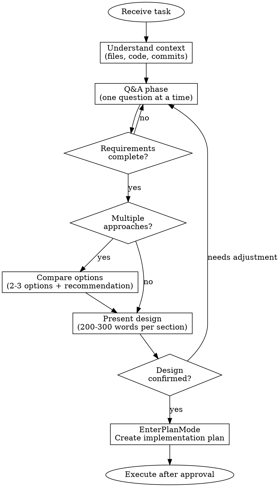

# Quick Brainstorm

## Overview

Lightweight brainstorming for bug fixes, small features, and code improvements. Ensures accurate output through deep questioning, then enters Plan Mode for execution.

**Core principle:** No limit on questions. Goal is accurate output. Skip obvious questions, only ask deep ones.

## Optional Parameters

- `--doc` - Write design doc to `docs/plans/YYYY-MM-DD-<topic>.md`
- `--worktree` - Create isolated branch for development
- `--plan-file` - Write implementation plan to file

## Process



## Phase 1: Q&A

**Principles:**
- One question at a time
- Prefer multiple choice
- Skip obvious questions
- **Keep asking until complete** - don't stop after just 1-2 questions

**Coverage (must consider each):**
1. **Technical implementation** - Data structures, API design, edge cases
2. **UI/UX** - Interaction flow, feedback states, error messages
3. **Potential concerns** - Performance impact, compatibility, side effects
4. **Trade-offs** - Pros/cons when multiple approaches exist
5. **Requirement exploration** - Discover related needs, potential extensions

**Self-check before ending Q&A:**
- [ ] Core functionality approach is clear
- [ ] User interaction and feedback discussed
- [ ] Edge cases and error handling covered
- [ ] No missing related requirements
- [ ] User explicitly says "ready to proceed" or similar

**Warning:** Only 1-2 questions before moving on = insufficient Q&A. Keep asking.

## Phase 2: Compare Options

**Trigger:** 2+ reasonable implementation approaches exist

**Format:**
```
Option A: [brief description]
  - Pros: ...
  - Cons: ...

Option B: [brief description]
  - Pros: ...
  - Cons: ...

Recommend [X] because [reason]
```

**Skip when:** Only one clearly optimal solution

## Phase 3: Present Design

**Approach:**
- Present in sections, 200-300 words each
- After each section: "Does this look right?"
- Adjust based on feedback before continuing

**Structure (trim as needed):**
1. Change overview - What and why
2. Technical approach - Implementation details, files involved
3. Data/API changes - If any
4. UI/interaction changes - If any
5. Edge cases and error handling - Key cases
6. Implementation steps - Brief execution order

## Phase 4: Enter Plan Mode

After design confirmation:
1. Use `EnterPlanMode` to enter planning mode
2. Create detailed implementation steps (files, expected changes)
3. Execute after user approval
4. Pause and ask if encountering uncovered scenarios

## Red Flags - STOP

- Writing code without asking any questions
- User says "no" but continuing with original approach
- Skipping option comparison and picking one approach
- Entering Plan Mode without design confirmation
- Executing without Plan Mode approval

**Any of these means: STOP. Return to the correct phase.**

## Common Mistakes

| Mistake | Correct Approach |
|---------|------------------|
| Start implementing directly | Ask questions first |
| Ask obvious questions | Only ask deep questions |
| Ask multiple questions at once | One question at a time |
| Present entire design at once | Present in sections, confirm each |
| Write code after design confirmation | Enter Plan Mode |
