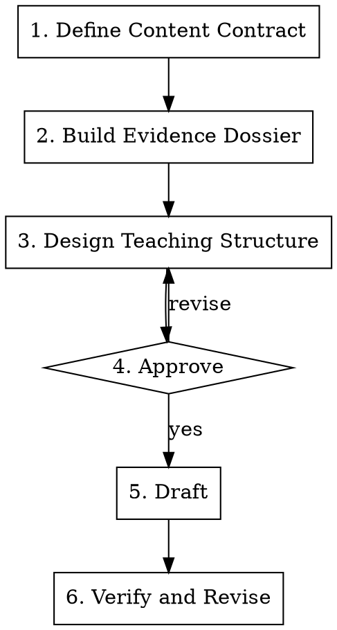

# Tech Writing

Plan, draft, and revise **Chinese-language professional technical content** — articles, book chapters, source walkthroughs, and more. Optimize for reader comprehension, technical correctness, explicit evidence boundaries, and durable teaching value.

Keep the main workflow focused on the article itself. Navigation, cross-references, and tracker updates are optional follow-up work after the content is technically and editorially stable.

## When to Use

- Writing a new Chinese-language technical article, book chapter, or long-form technical content
- Refactoring an existing Chinese technical article whose structure, reasoning, or tone is weak
- Explaining a mechanism, source path, specification rule, system behavior, comparison, or troubleshooting flow in Chinese
- Turning code reading, experiments, traces, or research notes into Chinese reader-oriented prose

## When Not to Use

- Site maintenance, sidebar work, tracker syncing, or link cleanup as the primary task
- Reference-manual-style listing without teaching structure or argument
- Lightweight copy editing that does not require content planning, evidence handling, or structural revision

## Quick Reference

| Step | Output |
|------|--------|
| Define Content Contract | Reader, problem, conclusion, outcome, non-goals, version scope, depth level |
| Build Evidence Dossier | Claim map with evidence type, source, and boundary |
| Design Teaching Structure | Opening strategy, section sequence, section jobs, intra-section narrative, asset plan |
| Approve | User confirms the contract, claim map, structure plan, and assumptions |
| Draft and Revise | Article draft plus review against editorial and evidence gates, ending with a references section |

## Core Workflow

## Refactoring vs. New Article

When the task is **refactoring an existing article**, adjust the workflow:

1. **Diagnose first**: read the existing article and identify its specific problems — structural disorder, insufficient depth, narrative gaps, missing concepts, evidence issues, or prose quality. Write a concise **Problem Diagnosis** listing each issue and its location. **Present the diagnosis to the user and wait for confirmation before proceeding** — the user may disagree with the assessment, add issues you missed, or deprioritize issues you flagged.
2. **Assess scope**: based on the confirmed diagnosis, decide whether the article needs a full rewrite (run all steps from scratch) or a targeted repair (update only the affected sections of the contract, claim map, and structure plan).
3. **Preserve what works**: if sections of the existing article are structurally sound and evidence-backed, carry them forward rather than rewriting from zero. The claim map only needs to cover claims that are new, changed, or previously unsupported.

**Presentation order for refactoring**: Problem Diagnosis (confirm) → Content Contract + Claim Map + Structure Plan (confirm) → Draft. Do not merge the diagnosis into the contract/structure plan as a single output — the user needs to validate the problem list before you design the solution.

For full rewrites, run the complete 5-step workflow. For targeted repairs, you may skip unchanged portions of the contract and claim map, but still run the full review gates (Step 6) on the final result.

## Step 1: Define Content Contract

### Information gathering discipline

Read **only** the target article (if refactoring) before doing anything else. Do not autonomously explore the codebase, search for source files, scan directory structures, or read nearby articles. If you need additional information (e.g., a source code file, a related article for terminology alignment, project conventions), **ask the user first** — describe what you need and why. The user can provide the information directly, point you to the right file, or approve a specific exploration scope.

This rule applies to files in the user's project. Reading this skill's own reference files (e.g., `chapter-archetypes.md`, `review-gates.md`, `chinese-typesetting.md`) is not autonomous exploration — those are part of the skill workflow and should be read as needed.

This rule exists because autonomous exploration wastes large amounts of tokens on speculative reads that usually turn out to be unnecessary. The user knows their project better than any search can reveal.

Before outlining, write a short **Content Contract** covering:

- **Reader**: who this article is for, and what they are assumed to already know
- **Core problem**: what confusion, mechanism, or decision this article resolves
- **Core conclusion**: the main takeaway the article must establish
- **Reader outcome**: what the reader should be able to explain, judge, or do after reading
- **Depth level**: one of three levels — **API-usage** (how to use it correctly), **principle** (why it works, design rationale, mental model), or **source-code** (implementation walkthrough with annotated code). This determines how deep every core knowledge point must go. For mechanism and source-walkthrough chapters, default to source-code level unless the contract explicitly restricts it.
- **Non-goals**: what this article will not try to cover
- **Version scope**: the primary version or implementation baseline

If any item is unclear and it materially changes the article, ask one focused question. Otherwise make the smallest reasonable assumption, record it in the content contract, and surface it for user confirmation before drafting.

## Step 2: Build Evidence Dossier

Do not plan from memory alone. Build a compact **Claim Map** before drafting:

| Claim | Evidence Type | Source | Boundary |
|------|---------------|--------|----------|
| Core conclusion or sub-claim | Spec fact / implementation fact / experiment / inference | Exact source material | Version, implementation, or confidence limit |

Rules:

- A statement without evidence must not be written as a hard conclusion.
- Separate **specification fact**, **implementation fact**, **observed result**, and **author inference**.
- If specification and implementation disagree, state the disagreement and limit the claim to the relevant scope.
- If an experiment is not clearly reproducible or representative, do not generalize it into a universal rule.

Depth check: for each core knowledge point, verify the evidence covers the depth level declared in the contract. At source-code level, "X works by doing Y" requires the actual source code as evidence, not just a prose summary.

## Step 3: Design Teaching Structure

Choose the chapter type that best matches the job of the article. Read [chapter-archetypes.md](references/chapter-archetypes.md) when selecting or adapting the structure.

Produce a **Structure Plan** with these fields:

- **Opening strategy**: question-first, conclusion-first, scenario-first, misconception-first, or comparison-first. State why this strategy fits this article's teaching job better than the alternatives. Read the selection rules and misuse patterns in [chapter-archetypes.md](references/chapter-archetypes.md) before deciding.
- **Section sequence**: ordered list of sections
- **Section job**: what each section contributes to reader understanding
- **Intra-section narrative**: for each non-trivial section, sketch the internal progression (e.g., "problem → design idea → new problem → solution → implementation" or "phenomenon → cause → evidence"). Flat knowledge-point lists are a red flag — if a section has no internal arc, it is either too thin or needs restructuring.
- **Deduplication map**: if two or more sections touch the same knowledge point (e.g., a mechanism detail, a threshold value, a design rationale), designate exactly one section as the authoritative location and mark the others as cross-reference only. Catching overlap at the structure stage prevents redundant prose that is harder to fix after drafting.
- **Evidence placement**: where code, experiments, specs, and diagrams appear
- **Asset plan**: which sections need a figure, table, trace, or runnable example
- **Link plan**: default to zero links. A cross-reference is justified only if removing it would leave the reader unable to follow the current section's argument. "The reader might want to know more" or "this topic is covered in depth later" is not sufficient — the series reading order already handles that. For each proposed link, state the specific sentence the reader could not understand without it. Links in the article opening that preview the next article are almost never justified.

Structure rules:

- Order sections by what the reader needs to understand next, not by the order in which the author discovered the material.
- Each section must have a distinct teaching purpose.
- Keep a short unnumbered lead under the H1 when it only orients the reader or points to adjacent articles. The lead should establish the core idea or context, not list what the article will cover — "this article explains A, B, C" is a table of contents, not an opening.
- If the opening material carries substantive background, prerequisites, problem framing, or a reading roadmap that the rest of the article depends on, promote it to the first numbered section and shift later sections accordingly.
- Do not invent a "Section 0" or any other pseudo-numbered preface inside the main article flow.
- Concepts should appear before they are used in dense reasoning, unless the opening intentionally starts from a symptom or conclusion.
- Examples, code, and diagrams must earn their place by reducing reader effort or proving a point.

## Step 4: Approve

Present the **Content Contract**, **Claim Map**, **Structure Plan**, and any explicit assumptions to the user.

- Wait for user confirmation before entering Step 5, even for small edits or limited rewrites.
- If the user adjusts the plan, update the plan first and only then begin drafting.

## Step 5: Draft

Only after the user approves the plan, write the article from the contract, claim map, and structure plan.

### Plan-to-Prose Firewall

The content contract, claim map, and structure plan are internal working documents. They guide the draft but must not leak into the prose. Specifically:

- **Non-goals stay internal.** The contract's "this article will not cover X" should not appear as disclaimers in the article. If the scope is clear from the content, the reader does not need to be told what is excluded.
- **Section jobs stay internal.** "This section establishes the reader's mental model of X" is a planning note. The article should just establish the mental model — without announcing that it is doing so. Sentences like "这条路径可以分为三个阶段：发送、存储、消费" are structure plan leakage disguised as prose.
- **Link plan entries are not automatic cross-references.** Re-evaluate each link at drafting time: does the reader need it to understand *this sentence*, or is it just navigation? Remove navigation links — especially "详见第 N 篇" blockquotes and "系列对应篇目" table columns that turn the article into a hub page.
- **Series awareness stays internal.** "这四个目标贯穿本系列所有篇目" and "是理解后续 N 篇的基础" are meta-commentary about the series structure. The reader is reading *this article*, not the series roadmap.

### Concept Introduction

Every new concept, term, or abstraction must be **motivated before named**:

1. First establish the need: explain the problem or gap that makes this concept necessary. The reader should be thinking "we need something to solve this" before they see the solution.
2. Then name and define it: introduce the term, give a one-sentence intuitive description, then expand into precise definition and detail.
3. Never let a term or data structure appear for the first time without the reader already understanding why it exists.

Anti-pattern: "X uses a FooBar internally. FooBar is a ..." — the reader encounters FooBar cold, with no idea why it matters. Instead: "X needs to solve [problem]. It does so by maintaining [intuitive description] — a structure called FooBar. Here is its definition: ..."

### Source Code Presentation

When the article includes source code analysis (common in mechanism and source-walkthrough articles):

- **Conclusion before code**: before showing a code block, state in one or two sentences what the code does and what design decision it embodies. The reader should know *what to look for* before reading the code.
- **Trim to the argument**: only show the code paths relevant to the current point. Mark omissions with comments (`// ... 省略 ...`). A 60-line method that makes one point should be shown as the 15 lines that make that point.
- **Annotate decisions, not syntax**: inline comments should mark design choices and non-obvious logic. Do not narrate self-evident lines (`i++ // increment i`).
- **Interleave code and prose**: for long source analysis, break the code into fragments. Between fragments, use prose to connect what the reader just saw to what comes next. A wall of code followed by a wall of explanation is harder to follow than an interleaved sequence.
- **Unpack dense expressions**: when a single line of code chains multiple operations that the target reader may not understand individually (e.g., bit manipulation, nested method calls, ternary cascades), do not just attach a summary comment. Break the line apart: explain each sub-operation's purpose separately, then show how they compose. Use concrete numeric examples to make abstract bit-level operations tangible.
- **Class structure before behavior**: when analyzing a class, show its key fields and their roles first, then walk through methods. The reader needs to know what state a method operates on before reading the method.

### General Drafting Defaults

- Start with an opening that fits the chapter type. Do not force a single opening template onto every article.
- Lead with the question, conclusion, symptom, or decision frame that best orients the reader.
- Explain **why** before **how** whenever the mechanism would otherwise feel arbitrary.
- Use code to prove or illuminate a point, not to bulk up the article.
- Prefer tables for comparison, boundary summaries, and trade-off discussions.
- **Single authoritative source**: when the same knowledge point (a rule, caveat, definition, or mechanism detail) is relevant to multiple sections, explain it fully in exactly one place and use brief cross-references elsewhere. Repeating the full explanation erodes reader trust ("didn't I just read this?") and creates maintenance drift when only one copy gets updated.
- Define or soften terminology based on the reader model established in the contract.
- Reuse local heading or formatting conventions when they already exist; otherwise choose a clear and consistent structure.
- Add a recap only when it materially helps synthesis, comparison, or retention.
- End the article with a `References` section, or a clearly equivalent local-language heading, that lists the authoritative materials actually relied on, prioritizing books, official documentation, specifications, RFCs, papers, and other primary sources.
- Keep the prose close to a professional technical book: precise, restrained, explanatory, and evidence-led.
- Avoid AI-flavored writing patterns: empty transitions, padded summaries, formulaic symmetry, self-referential framing ("this article explains...", "in this article we will..."), content-preview lists that restate the table of contents, motivational filler, and generic "completeness" language. See the expanded checklist in review-gates.md Gate 6 for specific patterns to watch for.
- **Cross-article variation**: when writing multiple articles in the same series, actively vary the internal structure of analogous sections. If two articles both have a "design goals" section, use different presentation forms (e.g., one uses bold-keyword paragraphs, the other uses a problem→solution narrative or a comparison table). If both have a "version history" section, vary the table columns and surrounding prose. Structural monotony across articles in a series is a strong signal of template-driven generation.
- Prefer direct claims and concrete explanation over broad, polished-sounding but low-information prose.
- Read [chinese-typesetting.md](references/chinese-typesetting.md) and apply its formatting rules.

## Step 6: Verify and Revise

Run through every gate in [review-gates.md](references/review-gates.md) before claiming the article is complete. **Output the result of each gate explicitly** — list every gate with pass/fail status, and for each failure note the specific location and the fix needed. Do not silently "pass everything in your head"; the user must see the gate results to trust the review. After fixing failures, re-run only the affected gates and report again. Only mark the article as complete when all gates pass.

## Optional Local Integration

Only after the article is stable, optionally:

- Add or adjust links to related articles only when readers genuinely need external background to understand the current article
- Do not add reciprocal, nearby, or "related topic" links that do not materially improve comprehension
- If the current article already explains enough local context, prefer keeping the reader in the article instead of sending them elsewhere
- Update local navigation or index structure if the project uses it
- Sync roadmap or tracker files if the project expects that maintenance

## Common Failure Modes

| Failure | Correction |
|---------|------------|
| Starting from a template instead of the article's teaching job | Define the content contract before outlining |
| Writing from memory when primary sources exist | Build the claim map from concrete source material |
| Drafting before the user confirms the plan | Present the contract, claim map, structure plan, and assumptions first; wait for approval |
| Adding links just to signal relatedness or system completeness | In openings, default to zero links; add a cross-reference only when it resolves a concrete comprehension gap, is not a self-link, and uses the established local format |
| Writing in polished but low-information AI cadence | Rewrite toward precise, declarative, evidence-led prose with concrete claims and fewer empty transitions |
| Omitting a references section at the end of an evidence-backed technical article | End with a `References` section, or a clearly equivalent local-language heading, listing the authoritative materials actually used |
| Letting code dumps substitute for explanation | Require each code block to support a specific insight; state the conclusion before showing the code |
| Mixing spec behavior, implementation detail, and observation | Label claim type and scope explicitly |
| Covering too much because the material is interesting | Use non-goals to keep the article bounded |
| Turning a short lead into a fake numbered preface, or inventing a "Section 0" | Keep brief orientation under the title; if the opening does real teaching work, promote it to Section 1 and renumber the rest |
| Using the same opening strategy for every article in a series | Each article has a distinct teaching job — match the opening to that job, not to a default template. Check the misuse patterns in chapter-archetypes.md |
| Same knowledge point explained in full in two or more sections | Designate one authoritative section in the structure plan (deduplication map); other sections cross-reference it |
| Imprecise quantifiers or scope words that accidentally widen or narrow a claim | Audit "等/etc.", "除非/unless", "所有/仅" against the actual scope |
| Preserving local style at the expense of clarity | Keep only the local conventions that do not harm comprehension |
| New concept/term appears without motivation | Establish the need before naming the solution; the reader should know *why* before *what* |
| Flat knowledge-point listing within a section | Each section needs an internal narrative arc, not just a sequence of facts |
| Insufficient depth for the article's declared level | Check every core knowledge point against the depth level in the contract; source-code level requires actual source, not prose summaries |
| Refactoring without diagnosing the existing article first | Write a Problem Diagnosis before rebuilding the contract and structure |
| Autonomously exploring the codebase, directory trees, or related files before asking the user | Read only the target article first; ask the user for any additional information before searching |
| Dense code line gets only a summary comment, reader still cannot follow | Break the expression into sub-operations, explain each one, then show how they compose with concrete examples |
| Planning language leaks into prose: "本篇建立…", "详见第 N 篇", "这条路径分为三个阶段" | Apply the plan-to-prose firewall: non-goals, section jobs, link plan entries, and series awareness are internal — write the content directly instead of announcing what you are about to write |
| Multiple articles in a series share identical section structures, table formats, or sentence patterns | Actively vary presentation forms across articles — same teaching job does not require same structure template |
